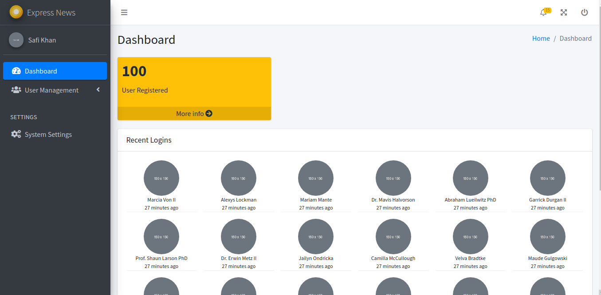

## About Laravel7-admin-starter
This is a very simple elegant admin dashboard starter template build in Laravel 7. It has admin, web, api routes. Admin guard.

## Installation
1. git clone https://github.com/semiPlanet/laravel7-admin-starter.git projectname
2. cd projectname
3. composer install
4. cp .env.example ./.env
5. change required database settings
6. php artisan key:generate
7. php artisan migrate
8. php artisan db:seed
9. php artisan serve
10. browse to http://127.0.0.1:8000
11. admin login email:admin@gmail.com password:password
